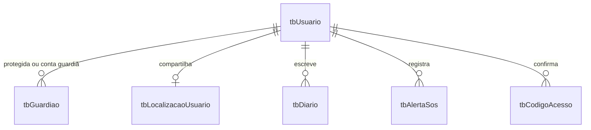

# Banco de dados Jaci

A referência é o arquivo `Documento de Thayna.sql`, fornecido pela usuária. Ele descrevia cinco entidades usando sintaxe do SQL Server (`GO` e chave estrangeira inline). A versão do projeto usa MySQL, InnoDB, UTF-8 e IDs inteiros autoincrementais.

| Referência             | Implementação                                                                              |
| ---------------------- | ------------------------------------------------------------------------------------------ |
| `tbUsuario`            | Identidade, senha com hash, perfil, telefone, confirmação de e-mail e versão da sessão     |
| `tbLocalizacaoUsuario` | Posição mais recente e CEP opcional; dados pessoais e senha não são duplicados             |
| `tbGuardiao`           | Vínculo entre protegida e conta do guardião, parentesco, disponibilidade, CEP e observação |
| `tbDiario`             | Notas de texto de até 500 caracteres, título e data/hora                                   |
| `tbAlertaSos`          | Data/hora unificada, status ativo/encerrado e encerramento                                 |
| `tbCodigoAcesso`       | Códigos de confirmação/recuperação com hash, validade e limite de tentativas               |

As credenciais de um guardião ficam em `tbUsuario`, como as de qualquer conta. O formulário de guardião inclui nome, e-mail, telefone, parentesco, disponibilidade, CEP e observação.

## Integridade e acesso

- E-mail único; um vínculo por par protegida/guardião.
- Chaves estrangeiras com remoção em cascata dos dados dependentes ao excluir uma conta.
- Índices por proprietário/data no diário e nos alertas.
- Apenas protegidas podem escrever notas, compartilhar posição e abrir/encerrar alertas.
- Guardiões não acessam o diário; somente localização compartilhada e SOS de protegidas vinculadas.
- Uma transação serializa a criação de SOS por usuária e reutiliza o alerta ativo.
- Códigos são consumidos uma única vez, com validade de 15 minutos e até cinco tentativas.
- Horários são tratados em UTC no driver e formatados em português pela interface.

## Banco anterior

O banco SQLite antigo, se existir, permanece no disco e não é lido pela nova API. A estrutura SQL original fornecida não contém registros para importar. Não há migração automática dos dados antigos: faça backup e planeje a conversão dos IDs e vínculos antes de migrar contas reais. Não execute alterações destrutivas para contornar incompatibilidades.

`001_estrutura.sql` é o esquema inicial desta versão. Mudanças futuras em tabelas já criadas precisam de novos arquivos com `ALTER TABLE`, revisados e aplicados em ordem; `CREATE TABLE IF NOT EXISTS` não altera uma estrutura já existente.
